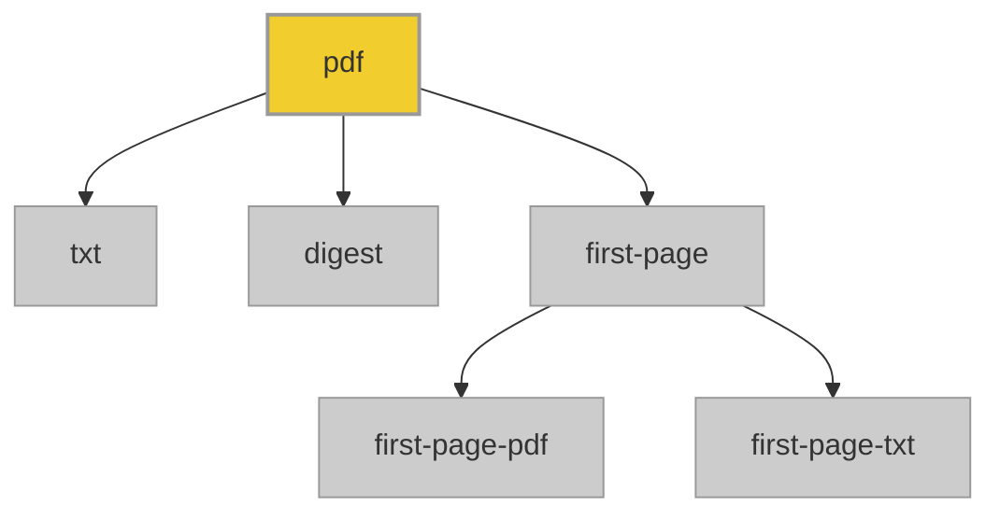

#  borb-pdf-corpus

This repository contains a curated corpus of PDF documents and their extracted content, organized to support document analysis, processing, and duplication detection workflows. Each PDF is accompanied by its full text (`txt/`), a first-page extract (`first-page-pdf/` and `first-page-txt/`), and a corresponding SHA-256 digest (`digest/`) for efficient duplication checks. 

The repository also includes automated metrics to help understand the overall structure, size, and temporal distribution of the documents.

## 1. File Size

| Property      | Value |
| ------------- | ----- |
| Smallest PDF | 2.00 KB |
| Average PDF | 1.48 MB |
| Largest PDF  | 55.19 MB |

## 2. Creation Year

| Property      | Value |
| ------------- | ----- |
| Youngest PDF | 2025 |
| Average PDF | 2015 |
| Oldest PDF  | 1999 |

## 3. Word Count

| Property      | Value |
| ------------- | ----- |
| Largest PDF | 346574 |
| Average PDF | 6682 |
| Smallest PDF  | 14 |

